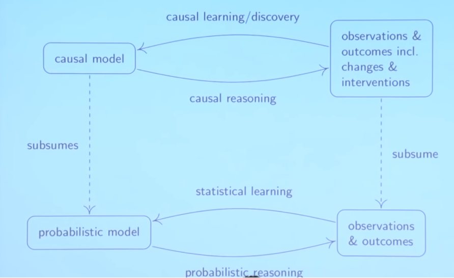

# Data Structures Easy to Advanced

## Definitions

A **Data Structure** \(DS\) is a way of organizing data so that it can be used efficiently. It is the implementation of an ADT. 

An **Abstract Data Type** \(ADT\) ****is an abstraction of a DS which provides only the interface to which a DS must adhere to. Defines how a DS should behave and what methods it should have, but not the details on how these methods are implemented.

_Examples of DS \(ADT\): LinkedList \(List\), Golf Cart \(Vehicle\)_


## Computational Complexity

_How much time/space does this algorithm need to finish?_

**Big-O Notation** defines the upper bound of complexity in the _worst_ case, where _n_ is the size of the input.

| Time | Big-O |
| :--- | :--- |
| Linear | O\(1\) |
| Logarithmic | O\(log\(n\)\) |
| Linear | O\(n\) |
| Linearithmic | O\(nlog\(n\)\) |
| Quadric/Cubic/Exponential | O\(n²\) / O\(n³\) / O\(bⁿ\) |
| Factorial | O\(n!\) |

Additionally, there are some important properties of Big-O notation.

$$
O(n+c) = O(n) \\ 
O(nc) = O(n) \\
O(n³ + 7n² + 4n) = O(n³)
$$

The properties can be defined as:  
- **Additive**: adding a constant to n will not impact _heavily_ the complexity  
- **Multiplicative:** multiplying n by a constant will not impact _heavily_ the complexity  
- **Dominant Term:** the complexity of an addition of complexities is their highest form.


## Static and Dynamic Arrays

A **static array** is a fixed length container containing n elements indexable from a range. Static arrays are given as contiguous chunks of memory.

A **dynamic array** can grow and shrink in size if needed.

_The creation of a dynamic array can be achieved with static arrays. Start a static array with a fixed size and empty values whenever needed, when the dynamic array requires a capacity larger than the initial static array create a copy of the static array with a factor of size \(e.g. double\)._

```julia
# Dynamic array of 3 elements as multiple static arrays of 2
arr = [1, nothing]

# Add second element -> 3
arr[2] = 3                     # arr = [1, 3]

# Add third element -> 10
arr = [arr..., 10, nothing]    # arr = [1, 3, 10, nothing]
```


## Linked Lists

A **Linked List** is a sequential list of nodes that hold data which point to other nodes also containing data. A **node** is an object containing data and pointers. The first node is called the **head**, which has a reference \(called **pointer**\) ****to another node, and so forth until we get to the last node called the **tail**.



_Singly vs Doubly_  
While the nodes on a **singly** linked list only reference the next node, on a **doubly** linked list  the nodes contain references to the next and the previous node. In comparison, a singly uses less memory and has a simpler implementation, but it cannot be traversed backwards, in contrast to the doubly which takes twice the memory but allows to easily access previous elements. 

