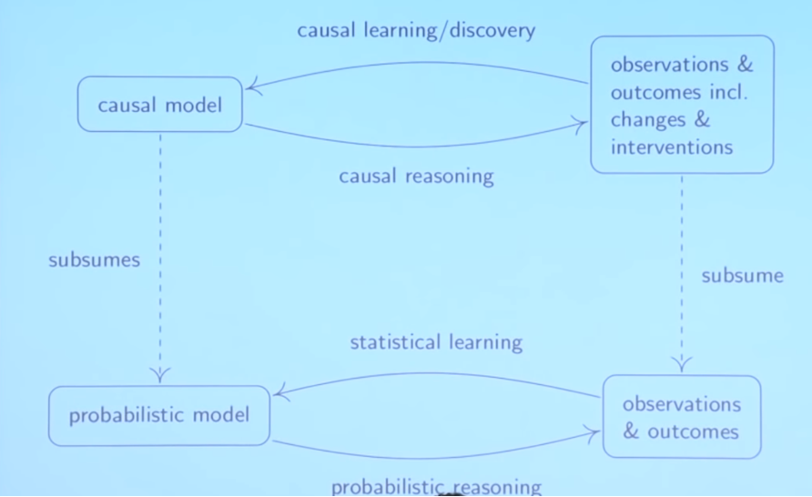

# Lectures on Causality

## Part 0 - Motivation

### Statistics vs Causality

In **statistics** we are often predicting the expected value of a dependent variable based on some observed valu1es of our inputs. In **causality** we are asking a different question of _"what happens if I actively change something in the system?"._ 

_YSK: A phenotype is term used in genetics for the composite observable traits of an organism._

We now consider two relationships between gene A, gene B and a phenotype. If gene A is really the causer of the phenotype, if we delete the gene A \(set the activity to zero\) we expect to see a change in the phenotype as well. On contrary, if gene B is not the causer for the phenotype but there is a hidden common causer for both gene B and the phenotype \(a.k.a. a confounder\), the best prediction for the phenotype when setting the activity of gene B to zero is to say that it will do as it always does, which is to stay within the range of observed values, so no change is expected in the phenotype caused by a change in gene B.

Be aware that we are now talking about **interventions** and not **observations** when talking about setting the genes activity to zero. We are actually actively deleting the gene B as opposed to observing a case.

### Learning and Reasoning

Overall, we talk about **learning** when we are building models based on data and **reasoning** when we are 

In the classical statistical setting, you start with a probabilistic model and then you can do some **probabilistic reasoning** \(e.g. if I get a sample what is the distribution of the mean\). In **statistical learning**, you go the other way around: when I get some observations, I want to infer some parameters about my probabilistic model.

In the other setting. when you are **causal reasoning** based on the causal model you not only make statements about observations but also about changes and interventions. When we are given some data, we want to infer something about the causal structure \(a.k.a. **structure learning**\).

There is some correspondence between the two settings but there is a major difference. Usually, in statistics you are often in the search for infinite number of data points; there's no point in estimating the mean if you can calculate based on the whole population, i.e. you are given the full distribution.  
In causality, even if you have an infinite amount of data points, the causal learning step does not become trivial because there is still the underlying problem of discovering the underlying causal structure. 

### What is a Causal Model?

Contrary to statistical models where we are just building a model for some distribution, on a **causal model** we will model several things at the same time:  
- **Distribution,** model the distribution that you observe \(e.g. data points\);  
- **Inverventional Distributions,** how the model reacts to interventions \(e.g. previous gene deletion\);  
- **Causal Graph**,  
- **Counterfactuals**, _what-if_ statements to be discussed later.

### Classical Examples of Non-Causality

#### Chocolate and Nobel Prizes

A known example of a strong correlation without a necessarily causal relationship is the relationship between countries per capita chocolate consumption and the number of Nobels per population. Assuming a causal relationship can lead to claiming things such as "Eating chocolate produces Nobel prize winners" or  "geniuses are more likely to eat lots of chocolate".

#### Kidney Stones

A clear example of how ignoring causality may lead to poor conclusions. Treatment A seems to be better both in small and large stones than Treatment B, but overall its total success rate is lower. Why? Because since Treatment A is expected to be better at dealing with difficult cases \(large stones\), its number of relative cases is biased towards those same difficult ones.

| Success Rate | Treatment A | Treatment B |
| :--- | :--- | :--- |
| Small Stones | 81/87 = 0.93 | 234/270 = 0.87 |
| Large Stones | 192/163 = 0.73 | 55/80 = 0.69 |
| **Total** | **273/350 = 0.78** | **289/350 = 0.83** |

As such, the size of the stone is a confounding factor of both the treatment \(e.g. larger stones will be more assigned towards Treatment A\) and the recovery \(e.g. larger stones have lower success rate\). The underlying question we are interested in is _"how the treatment influences the recovery?",_ i.e. the causal link between treatment and recovery. 

One example of intervention would be _"What is the expected recovery if all get Treatment B?"._

## Part 1 - Causal Language and Causal Reasoning 

Bear this picture in mind.

### Example 1 - Altitude and Temperature

Let's consider SCM\(S, Pᴺ\), i.e. a Structural Causal Model based on a set of equations S and a distribution Pᴺ of variables.

$$
X := N_X \\
Y:= -6X + N_Y \\
N_X, N_Y \stackrel{iid}{\sim} N(0, 1) \\
S = \{ X, Y\} ; Pᴺ = \{ N_X, N_Y\}
$$

What we are basically saying is that X variable is a factor for the Y,

By the properties of summing and multiplying distributions, we get that,

$$
Y \sim N(0, 37) \\
(X, Y) \sim N 
\begin{pmatrix}\begin{pmatrix}0 \\ 0 \end{pmatrix}, 
\begin{pmatrix} 1 & -6 \\ -6 & 37\end{pmatrix}\end{pmatrix}
$$

So, how do we consider interventions? Let's say that we fix the value for $$X:=3$$ , so that now $$Y \sim N(-18, 1)$$. On the other hand, we could intervene on the Y variable , which would cause the causal relationship to break and the two variables are now independent.

$$
Y \sim N(2,2) \\
(X, Y) \sim N 
\begin{pmatrix}\begin{pmatrix}0 \\ 2 \end{pmatrix}, 
\begin{pmatrix} 1 & 0 \\ 0 & 2\end{pmatrix}\end{pmatrix}
$$

### Example 2 - DAG

We can consider now a SCM with multiple random variables, in which some are causors of others.

Judea Pearl introduced the **do-notation** where we symbolize model interventions as follows. Bear in mind that the **interventions are not equivalent to conditionals**, i.e. $$P_{do(X_4:=13)} \neq P( \cdot | X_4 = 13)  $$. When intervening on $$X_4$$we are assigning its value, but we are not changing anything on its causors $$X_1, X_2, X_3$$. Additionally, not all the intervention assignments are constants.

In this example, P is a joint distribution on all the variables X₁, X₂, X₃ and X₄.

### Example 3 - Kidney Stones

We go back to the previous example of the kidney stones. We do have the causal structure but we do not have the Structural Causal Model. Our goal is, with a finite amount of data, can we somehow infer somehow the treatment-recovery interventional distribution and infer the treatment.

Goin back to the do-notation, what we want to compute is $$P_{do(T:=A)}$$from the **interventional distribution** but we only have data from the **observational distribution.**

_"If you intervene only on_ $$X_j$$_, you intervene only on_ $$X_j$$_"_

On the left, we have the **observational distribution** from where we have the data and in the right we have the **interventional distribution** where we set the treatment to A. For the interventional distribution, if we are intervening by setting the treatment to A, we are implicitly not changing the way the recovery depends on the size of the stone or/on \(??\) the treatment. By changing only the treatment, we are not intervening on the recovery, so the structural equation for the recovery remains the same. This also means that the conditional distributoin of the recovery given treatment and size does not change. Additionally, the marginal distribution of the size does not change with the intervention as well, $$P(S) = P_{do(T:=A)}(S)$$.

The solution is the following:

1. Marginalize over S , since recoveries \(R=1\) are fixed and the treatment is intervened \(T=A\)
2. Split the joint distribution $$P(A,B) = P(A|B) P(B)$$, drop the T=A in the P\(B\) part
3. Now the terms are the same for the observational and in the interventional distribution
4. Now we multiply, for each size of the stone, the recovery rate with treatment A by the marginal probability of such size: 0.93\*0.51 + 0.73 \* 0.49 = 0.832
5. If we do the same for treatment B, we get: 0.51 \* 0.87 + 0.49 \* 0.69 = 0.782

Now, we can assess the efficacy of both treatments without having the impact of the size of the stone biasing the more difficult cases towards Treatment A. Thus, the probability of recover if you force yourself to treatment A is 83.2% while in forcing yourself to treatment B is only 78.2%. As you can see, $$P_{do(T:=A)}(R=1) = 83.2\% \neq P(R=1 |  T=A) = 78\%$$.

On a more general note, we can apply such logic to many other variables as well. Formally, we are saying that we have a SCM over X, Y and some covariate W; we are interested in the causal effect of X to Y. _As an example, here X would be the treatment and Y would be the recovery rate._ Then, Z is a valid adjustment set if we can compute an averaging of the conditional of y on x and z by the probability of z.

The **Parent Adjustment** means that you can use the causal parents of X for adjustment.

